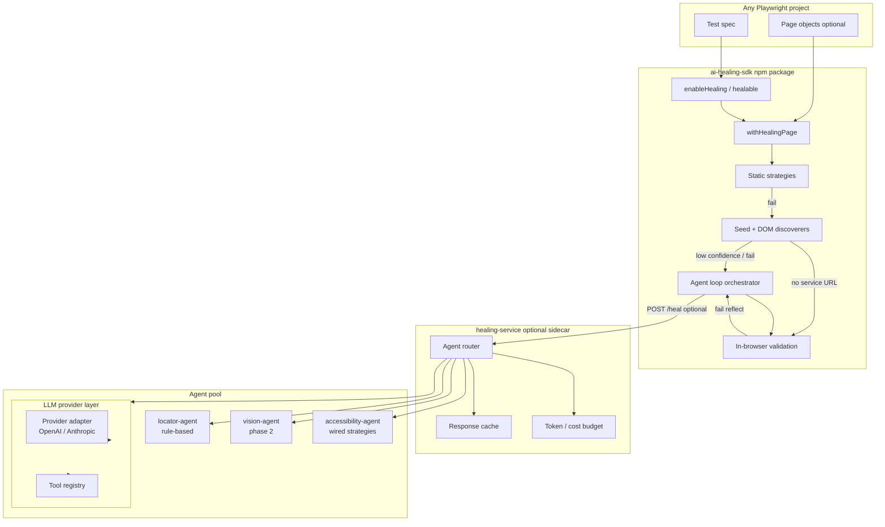

# PRD: Agentic AI Conversion for Self-Healing Playwright Framework

| Field | Value |
|-------|-------|
| **Document** | PRD-Agentic-AI-Conversion |
| **Version** | 1.1 |
| **Status** | Draft |
| **Author** | Engineering (agentic conversion initiative) |
| **Last updated** | 2026-06-12 |
| **Stakeholders** | QA Engineering, Platform, DevOps, Security |

---

## 1. Executive summary

The Self-Healing Playwright Framework today delivers **mature, rule-based locator recovery** across three layers (static fallbacks, seed rules, DOM scan) with optional HTTP gateway and a modular `locator-agent`. It is **not** agentic AI: there is no LLM inference, no observe–reason–act loop, and no dynamic tool use.

This PRD defines a **phased conversion** to a genuinely agentic healing system that:

1. **Preserves** existing rule-based healing as a fast, deterministic baseline.
2. **Adds** LLM-powered reasoning for ambiguous failures where heuristics fail.
3. **Introduces** a bounded agent loop (plan → propose locators → validate in browser → reflect → retry).
4. **Extends** the current Phase 1/2/3 architecture rather than replacing it.
5. **Ships as plug-and-play** — any Playwright project adds healing via `npm install ai-healing-sdk` with no dependency on this monorepo, Nova Retail page objects, or mandatory infrastructure.

**North-star outcome:** When a Playwright action fails, an agent can autonomously recover the test by reasoning over DOM context, failure history, and page intent—within cost, latency, and safety guardrails—while remaining auditable and CI-friendly. **Consumers adopt healing in minutes, not weeks**, and upgrade capability (rules → service → LLM) through configuration only.

**Distribution model:** `ai-healing-sdk` is the product; this repository is the reference implementation + healing-service + agent pool. Agentic features must surface exclusively through the SDK public API and optional sidecar service—never through internal `core/` imports.

---

## 2. Problem statement

### 2.1 Current limitations

| Limitation | Impact |
|------------|--------|
| Heuristics only | Novel UI patterns, shadow DOM, dynamic IDs, and i18n break seed/DOM rules |
| Single-shot discovery | No reflection when the top candidate fails validation |
| Hardcoded agent routing | `agent-router.ts` always returns `locator-agent`; no context-aware delegation |
| Unused strategies | `attribute-similarity`, `accessibility-recovery` exist but are not wired |
| `screenshotPath` unused | Visual context unavailable to recovery logic |
| No semantic understanding | Cannot infer intent from natural-language test step or page copy |
| "Reasoning" is static strings | Misleading for operators expecting AI explanations |

### 2.2 Opportunity

The existing contracts (`HealingRequest`, `HealingResponse`), HTTP gateway (`POST /heal`), DOM snapshot pipeline, confidence scoring, telemetry, and persistence hooks provide a **production-ready skeleton** for agentic extension. Conversion should plug into these seams—not rebuild from scratch.

---

## 3. Goals and non-goals

### 3.1 Goals

| ID | Goal | Success signal |
|----|------|----------------|
| G1 | Improve heal rate on heuristic failures by ≥30% on Nova Retail traceability suite | Measured on `@auto-heal` showcase + traceability TCs |
| G2 | Add LLM-backed locator synthesis behind feature flag | `HEALING_AGENT_MODE=llm` works in CI with mocked provider |
| G3 | Implement bounded agent loop with max N iterations | Loop terminates; no unbounded token spend |
| G4 | Keep rule-based path as default (zero LLM cost) | Default `npm test` unchanged in behavior/cost |
| G5 | Full audit trail: prompts, tool calls, candidates, outcomes | Attached to Playwright report + service telemetry |
| G6 | Provider-agnostic LLM layer | OpenAI + Anthropic supported in v1 |
| G7 | **Plug-and-play adoption** — external project heals with ≤5 lines of code change | `examples/playwright-plug-and-play` passes with agent mode on; published SDK documents 3-tier setup |

### 3.2 Plug-and-play principles (core constraint)

All agentic work **must** comply with these principles. They are non-negotiable design constraints, not nice-to-haves.

| Principle | Requirement |
|-----------|-------------|
| **SDK-first** | `ai-healing-sdk` is the only required dependency for consumers. Agentic behavior is configured via `enableHealing()`, `healable.*`, or `clickHealing()`/`fillHealing()` — not via monorepo internals. |
| **Zero mandatory infra** | Rules-based healing works in-process with no `healing-service`, no Docker, no LLM API key. |
| **Progressive enhancement** | Three adoption tiers (see §5.4); each tier is a strict superset of config, not a different API. |
| **No framework lock-in** | Consumers do not import `core/`, `pages/`, or Nova Retail fixtures. Reference app stays in `examples/`. |
| **Peer dependency model** | `@playwright/test` is a peer dependency; SDK version aligns with Playwright majors. |
| **Opt-in agentic** | LLM/agent loop never runs unless explicitly enabled (`HEALING_AGENT_MODE`, `agentMode` in config). Default install behavior unchanged. |
| **Sidecar, not embedded** | LLM inference and API keys live in `healing-service` (or hosted equivalent), not bundled inside the SDK npm package. |
| **Single public surface** | New agent features export through `packages/ai-healing-sdk/src/index.ts` only. No deep imports (`ai-healing-sdk/dist/agent/...`). |
| **Documented copy-paste path** | Every capability tier has a README quick-start that works in a fresh `npm init` project. |

### 3.3 Non-goals (v1)

- Autonomous test **generation** from scratch (healing only, not authoring)
- Autonomous test **repair** of assertion logic or business expectations
- Multi-framework support beyond Playwright (contract allows it; implementation deferred)
- Real-time human-in-the-loop approval UI (CLI/report only in v1)
- Fine-tuning custom models
- Replacing static strategy chains in page objects

---

## 4. User personas

| Persona | Need | Agentic value |
|---------|------|---------------|
| **QA Engineer** | Tests pass after UI locator drift | Higher recovery rate; clear reasoning in HTML report |
| **SDET / Framework owner** | Predictable CI, controllable cost | Feature flags, budgets, fallback to rules |
| **Platform / DevOps** | Secure secrets, observable service | API keys in env; structured telemetry |
| **Engineering manager** | ROI vs flake reduction | Dashboard KPIs from healing attachments |
| **External team / adopter** | Drop healing into existing Playwright repo | `npm install`, 3-line setup, no monorepo fork |

---

## 5. Current state (baseline)

### 5.1 Architecture today

```
Playwright test
  └─ withHealingPage (retry-orchestrator.ts)
       ├─ Layer 1: static LocatorStrategy[] (page objects)
       ├─ Layer 2: seed-discovery (opt-in, AUTO_HEAL_DISCOVER)
       ├─ Layer 3: dom-scan-discovery (opt-in)
       └─ Optional: HTTP → healing-service → locator-agent (HEALING_SERVICE_URL)
```

### 5.2 Extension points to reuse

| Component | Path | Reuse for agentic |
|-----------|------|-------------------|
| Request contract | `packages/ai-healing-sdk/src/transport/contracts.ts` | Extend `HealingRequest` with agent context |
| DOM capture | `dom-scan-discovery.ts`, `buildHealingRequest()` | Feed LLM context (trimmed/summarized) |
| Discoverer resolution | `resolve-discoverer.ts` | Add `llm-discoverer` alongside local/http |
| Agent router | `services/healing-service/src/routing/agent-router.ts` | Context-aware multi-agent routing |
| Locator agent | `agents/locator-agent/` | Becomes "fast path" agent in ensemble |
| Scoring | `confidence-scorer.ts` | Merge rule + LLM scores |
| Telemetry | `telemetry/events.ts`, `healing-reporter.ts` | Agent step events |
| Persistence | `persistence.ts` | Unchanged; persist only high-confidence heals |

### 5.3 What stays rule-based

Static fallback chains remain the **first line of defense**—fast, free, deterministic. LLM agents activate only when:

- `HEALING_AGENT_MODE` is not `off`, AND
- Static + rule-based auto-heal exhausted or confidence below threshold, OR
- Explicit `forceAgent: true` in test options.

### 5.4 Plug-and-play baseline (today)

The SDK already supports external adoption. Reference consumer: `examples/playwright-plug-and-play/` — imports `ai-healing-sdk` as a **file/npm package**, not parent `core/`.

**Tier 1 — Minimal (2 dependencies, ~5 lines)**

```ts
import { enableHealing, healable } from 'ai-healing-sdk';

test.beforeEach(async ({ page }) => {
  enableHealing(page, { healingEnabled: true });
});
await healable.click(page.getByRole('button', { name: /sign in/i }));
```

Works in-process: static retries + optional rule-based discovery via env (`AUTO_HEAL_DISCOVER=1`). **No server. No API keys.**

**Tier 2 — Remote rules gateway (env only)**

```bash
export HEALING_SERVICE_URL=http://localhost:3921
export AUTO_HEAL_DISCOVER=1
```

Same SDK code. Discovery offloads to `healing-service` → `locator-agent`. Fallback to local if `HEALING_SERVICE_FALLBACK_LOCAL=1`.

**Tier 3 — Agentic / LLM (env + sidecar, same SDK code)**

```bash
export HEALING_SERVICE_URL=http://localhost:3921
export HEALING_AGENT_MODE=hybrid
# API keys set on healing-service only — NOT in test project
```

**Two public APIs (both must support all tiers):**

| API | Audience | Entry points |
|-----|----------|--------------|
| **Healable** | Teams wanting zero page-object refactor | `enableHealing`, `healable.click/fill`, `attachHealingSummary` |
| **Strategy** | Teams with page objects / explicit fallbacks | `clickHealing`, `fillHealing`, `LocatorStrategy[]` |

**Gap for agentic conversion:** `HealingSdkConfig` has no `agentMode` yet; plug-and-play example does not demo Tier 3; SDK not published to npm registry (file path only); no standalone README in `examples/playwright-plug-and-play/`.

---

## 6. Target architecture

### 6.1 High-level diagram



### 6.2 Agentic loop (core behavior)

```
OBSERVE  → Capture DOM snapshot, failure hints, optional screenshot, attempt history
REASON   → LLM analyzes context; may call tools (query DOM subset, search history, list similar heals)
PROPOSE  → Returns 1–K locator candidates with structured Playwright queries
ACT      → SDK validates each candidate via locator.count() + action retry
REFLECT  → If all fail, append outcomes to context; loop if iterations < MAX_AGENT_ITERATIONS
COMMIT   → On success: record history, optional persistence, attach telemetry
```

**Hard bounds (v1 defaults):**

| Guardrail | Default |
|-----------|---------|
| `MAX_AGENT_ITERATIONS` | 3 |
| `MAX_CANDIDATES_PER_ITERATION` | 5 |
| `MAX_LLM_TOKENS_PER_HEAL` | 8,000 |
| `AGENT_TIMEOUT_MS` | 30,000 |
| `MIN_LLM_CONFIDENCE_TO_TRY` | 0.55 |

---

## 7. Functional requirements

### 7.1 LLM provider layer (new package: `packages/llm-provider`)

| ID | Requirement | Priority |
|----|-------------|----------|
| FR-1 | Abstract `LlmClient` interface: `complete()`, `completeWithTools()`, streaming optional | P0 |
| FR-2 | Adapters for OpenAI and Anthropic via env config | P0 |
| FR-3 | Structured output mode: JSON schema for `LocatorProposal[]` | P0 |
| FR-4 | Retry with exponential backoff on rate limits | P1 |
| FR-5 | Token counting + cost estimation per request | P1 |
| FR-6 | Redact PII patterns from prompts (email, phone) before send | P1 |

**Env vars:**

```
HEALING_LLM_PROVIDER=openai|anthropic|mock
HEALING_LLM_MODEL=gpt-4o-mini
HEALING_LLM_API_KEY=...
HEALING_LLM_MAX_TOKENS=8000
```

### 7.2 LLM locator agent (new: `agents/llm-locator-agent`)

| ID | Requirement | Priority |
|----|-------------|----------|
| FR-7 | Accept `HealingRequest`; produce `ScoredLocatorCandidate[]` | P0 |
| FR-8 | System prompt encodes Playwright locator best practices (prefer role+name, avoid brittle CSS) | P0 |
| FR-9 | User prompt includes: action type, failed locator, error, URL, title, trimmed DOM (top N by relevance) | P0 |
| FR-10 | Output must map to existing `GeneratedLocatorQuery` union (`css` \| `role`) | P0 |
| FR-11 | Include `reasoning` field: model-generated explanation (max 500 chars) | P0 |
| FR-12 | Fallback to `locator-agent` if LLM errors or times out | P0 |

### 7.3 Agent tools (server-side, called by LLM)

| Tool | Description | Priority |
|------|-------------|----------|
| `search_dom` | Filter DOM snapshot by tag, role, text, aria-label | P0 |
| `get_failure_history` | Query `.self-healing-history.json` for URL + action patterns | P1 |
| `list_heuristic_candidates` | Invoke existing seed + dom-scan; return as context | P0 |
| `score_candidate` | Run confidence scorer on a proposed query | P1 |
| `capture_screenshot_region` | Deferred; requires SDK callback | P2 |

Tools execute **inside healing-service** (no arbitrary code execution). LLM never receives raw page.evaluate strings from tests.

### 7.4 Agent loop orchestrator (SDK)

| ID | Requirement | Priority |
|----|-------------|----------|
| FR-13 | New `runAgentHealingLoop()` in `packages/ai-healing-sdk/src/agent/` | P0 |
| FR-14 | Integrate into `withHealingPage` when `autoHeal.agentMode !== 'off'` | P0 |
| FR-15 | Each iteration: POST enriched `HealingRequest` with `iteration`, `priorAttempts` | P0 |
| FR-16 | Stop on first validated candidate success | P0 |
| FR-17 | Emit `agent.step` telemetry events per iteration | P1 |

### 7.5 Intelligent agent router (healing-service)

| ID | Requirement | Priority |
|----|-------------|----------|
| FR-18 | Replace hardcoded router with policy-based routing | P0 |
| FR-19 | Route rules (v1): always run `locator-agent` first; if best confidence < 70 → add `llm-locator-agent` | P0 |
| FR-20 | Optional: route to `accessibility-agent` when failure hints contain a11y signals | P1 |
| FR-21 | Merge and dedupe candidates from multiple agents | P0 |

**Target `agent-router.ts` behavior:**

```
if (request.metadata?.forceLlm) → [locator-agent, llm-locator-agent]
else if (heuristicPreScore < 70) → [locator-agent, llm-locator-agent]
else → [locator-agent]
```

### 7.6 Contract extensions

Extend `HealingRequest` in `contracts.ts`:

```typescript
export type AgentHealContext = {
  iteration: number;
  maxIterations: number;
  priorCandidates?: HealingResponseCandidate[];
  priorValidationResults?: Array<{
    healedLocator: string;
    ok: boolean;
    error?: string;
  }>;
  testStepDescription?: string;  // from test annotation or page object
  agentMode?: 'off' | 'rules_only' | 'hybrid' | 'llm_first';
};

// Add to HealingRequest:
agentContext?: AgentHealContext;
screenshotBase64?: string;  // optional, max 200KB, when HEALING_AGENT_VISION=1
```

Extend `HealingResponse`:

```typescript
export type AgentTrace = {
  agentId: string;
  iteration: number;
  model?: string;
  promptTokens?: number;
  completionTokens?: number;
  toolCalls?: Array<{ name: string; input: unknown; outputSummary: string }>;
  latencyMs: number;
};

// Add to HealingResponse:
agentTrace?: AgentTrace[];
```

### 7.7 Wire dormant strategies

| ID | Requirement | Priority |
|----|-------------|----------|
| FR-22 | Wire `attribute-similarity` and `accessibility-recovery` into `runLocatorAgent` | P1 |
| FR-23 | Expose as standalone `accessibility-agent` for router | P2 |

### 7.8 Reporting and observability

| ID | Requirement | Priority |
|----|-------------|----------|
| FR-24 | Playwright attachment: `agent-trace.json` with redacted prompts | P0 |
| FR-25 | Healing reporter shows: agent used, model, iterations, winning reasoning | P0 |
| FR-26 | Service logs: `heal.agent_iteration`, `heal.llm_call`, `heal.budget_exceeded` | P1 |
| FR-27 | Dashboard ingest: new KPIs `agent_heal_rate`, `avg_iterations`, `llm_cost_usd` | P2 |

### 7.9 Configuration surface

| Variable | Values | Default | Description |
|----------|--------|---------|-------------|
| `HEALING_AGENT_MODE` | `off`, `hybrid`, `llm_only` | `off` | Agent activation |
| `HEALING_AGENT_MAX_ITERATIONS` | 1–5 | `3` | Loop cap |
| `HEALING_AGENT_MIN_CONFIDENCE` | 0–100 | `70` | Router threshold |
| `HEALING_LLM_PROVIDER` | `mock`, `openai`, `anthropic` | `mock` | Provider |
| `HEALING_AGENT_VISION` | `0`, `1` | `0` | Send screenshot to vision model |
| `HEALING_AGENT_BUDGET_USD` | number | `0.50` | Per-request spend cap (service) |
| `HEALING_AGENT_FALLBACK_RULES` | `0`, `1` | `1` | Fall back to rules on LLM failure |

Test-level override via `HealingOptions`:

```typescript
autoHeal?: {
  agentMode?: 'off' | 'hybrid' | 'llm_only';
  maxIterations?: number;
  testStepDescription?: string;
};
```

### 7.10 Plug-and-play distribution requirements

| ID | Requirement | Priority |
|----|-------------|----------|
| FR-28 | Extend `HealingSdkConfig` with `agentMode`, `healingServiceUrl`, `agentMaxIterations` — same config object for all tiers | P0 |
| FR-29 | `enableHealing(page, config)` passes agent settings to engine via `sdkConfigToEngineOptions()` | P0 |
| FR-30 | `healable.*` auto-wraps locators as implicit single-strategy chains (no page-object rewrite required) | P0 |
| FR-31 | Agent loop works when only `healing-service` URL is set; LLM keys never required in consumer env | P0 |
| FR-32 | Publish `ai-healing-sdk` to npm with `peerDependencies: { "@playwright/test": ">=1.40" }` | P1 |
| FR-33 | Publish `healing-service` as optional Docker image (`docker run -e HEALING_LLM_API_KEY=...`) | P1 |
| FR-34 | Add `examples/playwright-plug-and-play/README.md` with Tier 1/2/3 copy-paste guides | P0 |
| FR-35 | Add `examples/playwright-plug-and-play-agentic/` demo: Tier 3 with mock LLM, no Nova Retail coupling | P1 |
| FR-36 | CLI helper: `npx ai-healing-init` scaffolds `enableHealing` in existing Playwright project (optional) | P2 |
| FR-37 | SDK bundle size: core package < 500KB; LLM client not bundled in SDK | P0 |
| FR-38 | `attachHealingSummary` includes agent tier used (`local` \| `service-rules` \| `service-llm`) | P1 |

**Consumer `package.json` (target):**

```json
{
  "dependencies": {
    "ai-healing-sdk": "^2.0.0"
  },
  "devDependencies": {
    "@playwright/test": "^1.51.0"
  }
}
```

**Anti-patterns (explicitly forbidden):**

- Requiring consumers to clone this monorepo
- Requiring consumers to copy `core/` or `pages/` into their project
- Putting `HEALING_LLM_API_KEY` in Playwright test process env
- Breaking changes to `healable` / `enableHealing` signatures without major version bump

---

## 8. Non-functional requirements

| ID | Category | Requirement |
|----|----------|-------------|
| NFR-1 | Latency | P95 heal with LLM < 15s (excluding Playwright action time) |
| NFR-2 | Availability | LLM outage must not break tests when `HEALING_AGENT_FALLBACK_RULES=1` |
| NFR-3 | Cost | Default CI path (`HEALING_AGENT_MODE=off`) adds $0 |
| NFR-4 | Security | API keys only in env/secrets; never logged or attached to reports |
| NFR-5 | Privacy | DOM snapshots redacted (password fields, credit card patterns) before LLM |
| NFR-6 | Determinism | Same input + `temperature=0` → stable candidates (within provider variance) |
| NFR-7 | Testability | `HEALING_LLM_PROVIDER=mock` for unit/integration tests without network |
| NFR-8 | Backward compat | Phase 1/2/3 tests pass unchanged with agent mode off |
| NFR-9 | **Adoption friction** | New project: install → first healed test in < 15 minutes following README | 
| NFR-10 | **Portability** | Plug-and-play example runs from `file:` path and from published npm tarball identically |
| NFR-11 | **Separation of concerns** | SDK has zero runtime dependency on `express`, `openai`, or `anthropic` packages |

---

## 9. Phased delivery plan

### Phase 4 — LLM foundation (4–6 weeks)

**Objective:** Provider layer + LLM locator agent behind feature flag; no loop yet.

| Deliverable | Location |
|-------------|----------|
| `packages/llm-provider` | New workspace package |
| `agents/llm-locator-agent` | New agent package |
| Mock provider + golden prompt tests | `tests/llm-locator-agent.unit.spec.ts` |
| Router invokes LLM agent when `HEALING_AGENT_MODE=hybrid` | `agent-router.ts` |
| Contract extensions (optional fields) | `contracts.ts` |
| Docs: env setup, cost guidance | `docs/agentic-healing-setup.md` |
| `agentMode` on `HealingSdkConfig` | `packages/ai-healing-sdk/src/utils/config.ts` |
| Plug-and-play README (Tier 1–3) | `examples/playwright-plug-and-play/README.md` |
| `npm run test:plug-and-play:agentic` script | root `package.json` |

**Exit criteria:**
- [ ] With `HEALING_LLM_PROVIDER=mock`, phase4 integration test heals a broken locator
- [ ] With agent mode off, all existing tests green
- [ ] LLM reasoning appears in HTML report attachment
- [ ] **Plug-and-play example passes with `HEALING_AGENT_MODE=hybrid` using only SDK + service URL (no monorepo imports)**

### Phase 5 — Agent loop + tools (4–6 weeks)

**Objective:** Observe–reason–act–reflect loop in SDK; tool registry in service.

| Deliverable | Location |
|-------------|----------|
| `agent-loop-orchestrator.ts` | `packages/ai-healing-sdk/src/agent/` |
| Tool implementations | `services/healing-service/src/tools/` |
| Enriched `HealingRequest` with iteration context | SDK + service |
| Wire dormant heuristic strategies | `locator-agent.ts` |
| Budget enforcement | `healing-service/src/budget/` |

**Exit criteria:**
- [ ] Loop recovers locator that fails on first LLM proposal but succeeds on iteration 2
- [ ] `MAX_AGENT_ITERATIONS` respected; no infinite loops in stress test
- [ ] Token budget abort returns `no_match` + telemetry, test fails gracefully

### Phase 6 — Vision + advanced routing (6–8 weeks)

**Objective:** Optional screenshot analysis; smarter routing; dashboard KPIs.

| Deliverable | Location |
|-------------|----------|
| `agents/vision-agent` | Screenshot → element region proposals |
| Screenshot capture in SDK | `http-transport.ts` `buildHealingRequest` |
| Context-aware router (hints, action type, page class) | `agent-router.ts` |
| Dashboard KPI extension | `docs/dashboard-ingest.md`, scripts |
| `accessibility-agent` as routed peer | `agents/` |

**Exit criteria:**
- [ ] Shadow DOM / canvas-adjacent case improved vs Phase 5 on benchmark set
- [ ] Dashboard shows agent heal rate and cost metrics

### Phase 7 — Production hardening + distribution (ongoing)

- Rate limiting per CI job / API key
- Prompt versioning and A/B evaluation harness
- Human review queue for persisted heals (optional Git PR bot)
- Evaluation dataset from Nova Retail traceability failures
- **npm publish** `ai-healing-sdk@2.x` with migration guide from 1.x
- **Docker image** `healing-service` with compose file for Tier 2/3 local dev
- Optional hosted healing-service SaaS (out of scope for v1 implementation; document extension point)

---

## 10. Implementation map (file-level)

| Action | File / package |
|--------|----------------|
| **Create** | `packages/llm-provider/src/` |
| **Create** | `agents/llm-locator-agent/src/` |
| **Create** | `packages/ai-healing-sdk/src/agent/agent-loop-orchestrator.ts` |
| **Create** | `services/healing-service/src/tools/` |
| **Create** | `services/healing-service/src/budget/token-budget.ts` |
| **Modify** | `packages/ai-healing-sdk/src/transport/contracts.ts` |
| **Modify** | `packages/ai-healing-sdk/src/retry/retry-orchestrator.ts` |
| **Modify** | `packages/ai-healing-sdk/src/transport/http-transport.ts` |
| **Modify** | `services/healing-service/src/routing/agent-router.ts` |
| **Modify** | `agents/locator-agent/src/locator-agent.ts` |
| **Modify** | `packages/ai-healing-sdk/src/reporters/healing-reporter.ts` |
| **Create** | `playwright.phase4.config.ts` |
| **Create** | `tests/llm-locator-agent-phase4.spec.ts` |
| **Create** | `tests/agent-loop-phase5.spec.ts` |
| **Create** | `examples/playwright-plug-and-play/README.md` |
| **Create** | `examples/playwright-plug-and-play-agentic/` |
| **Modify** | `packages/ai-healing-sdk/src/utils/config.ts` (agentMode) |
| **Modify** | `packages/ai-healing-sdk/package.json` (peerDeps, exports map) |
| **Create** | `services/healing-service/Dockerfile` |

---

## 11. Prompt design (v1 sketch)

### 11.1 System prompt (llm-locator-agent)

Key instructions:

- You are a Playwright test healing assistant.
- Output JSON only: `{ "candidates": [{ "query": { "type": "role"|"css", ... }, "confidence": 0-1, "reasoning": "..." }] }`.
- Prefer `getByRole` with accessible names over CSS selectors.
- Never propose XPath.
- Use `failureHints` and `action` to infer target element.
- If DOM snapshot is ambiguous, call `search_dom` tool before proposing.

### 11.2 Context trimming

DOM snapshots can exceed token limits. Pre-process:

1. Rank elements by text/role match to `failureHints` (reuse `intent-hints.ts`).
2. Send top 40 elements + summary stats ("142 total elements, 12 buttons").
3. Include full snapshot in tool call if model requests `search_dom`.

### 11.3 Reflection prompt (iteration > 1)

Append:

```
Previous candidates failed validation:
- role=button[name="Submit"] → count=0
- #login-btn → count=0
Propose different candidates. Do not repeat failed locators.
```

---

## 12. Security and compliance

| Risk | Mitigation |
|------|------------|
| API key leakage | Keys in CI secrets only; scanner in pre-commit |
| Sensitive DOM in prompts | Redact `type=password`, `autocomplete=cc-*`, known PII regex |
| Prompt injection via page content | Sanitize DOM text; system prompt ignores page "instructions" |
| Unbounded cost | Per-heal token + USD budget; circuit breaker |
| Data residency | Document provider region; support Azure OpenAI later |

---

## 13. Success metrics

| Metric | Baseline (today) | Target (6 mo post Phase 5) |
|--------|------------------|------------------------------|
| Heal rate (auto-heal showcases) | Measure in Phase 0 benchmark | +30% |
| Heal rate (traceability TCs with broken locators) | Benchmark subset | +25% |
| False positive heals (wrong element clicked) | Track manually | < 2% |
| P95 agent heal latency | N/A | < 15s |
| LLM cost per healed test | $0 | < $0.05 median |
| CI pass rate (agent off) | 100% current | 100% (no regression) |

**Phase 0 benchmark task (pre-Phase 4):** Script that breaks locators intentionally across 20 scenarios and records heal rate for rules-only vs future agent.

---

## 14. Risks and mitigations

| Risk | Likelihood | Impact | Mitigation |
|------|------------|--------|------------|
| LLM proposes invalid Playwright queries | High | Medium | JSON schema validation; reject malformed |
| Cost overrun in CI | Medium | High | Default off; budgets; mock in CI |
| Flaky heals (non-deterministic) | Medium | High | temperature=0; require 2 validation passes |
| Provider outage | Medium | Medium | Fallback to rules; cache successful heals |
| Over-reliance on LLM | Low | Medium | Rules always run first in hybrid mode |
| "AI" marketing mismatch | Medium | Low | Docs: hybrid system; show trace in reports |

---

## 15. Testing strategy

| Layer | Approach |
|-------|----------|
| Unit | Mock LLM returns fixed JSON; test parsing, routing, budget |
| Contract | `HealingRequest`/`HealingResponse` snapshot tests |
| Integration | `playwright.phase4.config.ts` spins healing-service + mock provider |
| E2E | Showcase specs with intentionally broken locators |
| Evaluation | Held-out set of 50 real failure DOM snapshots; score top-1 / top-3 |
| Regression | Full `npm test` with `HEALING_AGENT_MODE=off` on every PR |

---

## 16. Open questions

| # | Question | Owner | Decision deadline |
|---|----------|-------|-------------------|
| OQ-1 | Default model: `gpt-4o-mini` vs `claude-3-5-haiku` for cost/quality? | Platform | Phase 4 kickoff |
| OQ-2 | Run LLM in CI with real API or mock-only until Phase 6? | DevOps | Phase 4 |
| OQ-3 | Persist LLM-healed locators automatically or human review? | QA Lead | Phase 5 |
| OQ-4 | Support local Ollama for air-gapped environments? | Platform | Phase 6+ |
| OQ-5 | Include test step description from Gherkin/traceability matrix? | QA | Phase 5 |
| OQ-6 | Publish SDK to public npm or private registry first? | Platform | Phase 4 |
| OQ-7 | Offer hosted `healing-service` or Docker-only for Tier 3 adopters? | Product | Phase 7 |
| OQ-8 | Should `healable` infer strategies from any `Locator` or only role/label/css? | SDK | Phase 4 |

---

## 17. Acceptance criteria (release readiness)

**Phase 4 release:**

- [ ] `HEALING_AGENT_MODE=hybrid` documented and working locally
- [ ] Mock provider passes all new unit/integration tests
- [ ] At least one real-provider integration test documented (manual/nightly)
- [ ] No regression in default test run
- [ ] Security review of prompt content and redaction

**Phase 5 release:**

- [ ] Agent loop with reflection recovers multi-step failure scenario
- [ ] Budget guardrails tested
- [ ] `agent-trace.json` in Playwright report
- [ ] Benchmark shows measurable heal rate improvement vs rules-only

---

## 18. Appendix A — Adoption tiers (plug-and-play)

| Tier | Consumer installs | Consumer configures | Infra required | Agentic |
|------|-------------------|---------------------|----------------|---------|
| **1 — SDK only** | `ai-healing-sdk` | `enableHealing(page, { healingEnabled: true })` | None | Rules in-process |
| **2 — Service rules** | `ai-healing-sdk` | `HEALING_SERVICE_URL` + `AUTO_HEAL_DISCOVER=1` | `healing-service` (no LLM key) | Rule agents remote |
| **3 — Service agentic** | `ai-healing-sdk` (unchanged) | `HEALING_AGENT_MODE=hybrid` | `healing-service` + LLM key on **service** | LLM + loop |

**Key rule:** Tiers differ only by **environment and sidecar config**. Test code stays identical across tiers.

## 19. Appendix B — Mode comparison

| Mode | Static chains | Seed/DOM | LLM agent | Loop | Cost |
|------|---------------|----------|-------------|------|------|
| **Today (default)** | ✅ | ❌ | ❌ | ❌ | $0 |
| **Today (AUTO_HEAL_DISCOVER)** | ✅ | ✅ | ❌ | ❌ | $0 |
| **Hybrid (target)** | ✅ | ✅ | ✅ fallback | ✅ | $ |
| **LLM only** | ✅ | ❌ | ✅ | ✅ | $$ |

---

## 20. Appendix C — Relationship to existing phases

| Phase | Name | Status | Agentic role after conversion |
|-------|------|--------|-------------------------------|
| 1 | In-process SDK discovery | ✅ Done | Unchanged; fast path |
| 2 | HTTP healing-service | ✅ Done | Hosts agent pool + tools |
| 3 | locator-agent module | ✅ Done | Rule-based agent in ensemble |
| **4** | LLM locator agent | 🔲 Planned | First AI inference |
| **5** | Agent loop + tools | 🔲 Planned | True agentic behavior |
| **6** | Vision + advanced routing | 🔲 Planned | Multimodal + smarts |

---

## 21. Appendix D — Consumer integration checklist

Use this checklist when onboarding an external Playwright project:

- [ ] `npm install ai-healing-sdk @playwright/test`
- [ ] Add `enableHealing(page, { healingEnabled: true })` in `beforeEach` or fixture
- [ ] Replace `locator.click()` with `healable.click(locator)` **or** keep page objects and use `clickHealing()`
- [ ] Optional: `attachHealingSummary(testInfo, label, result)` for HTML report
- [ ] Tier 2+: run `healing-service` (`docker compose up` or `npm run healing-service` in monorepo dev)
- [ ] Tier 2+: set `HEALING_SERVICE_URL` in `.env` (not committed)
- [ ] Tier 3+: set `HEALING_AGENT_MODE=hybrid`; configure LLM key on **service container only**
- [ ] CI: use `HEALING_AGENT_MODE=off` or `HEALING_LLM_PROVIDER=mock` unless budget approved

## 22. Appendix E — Sample agent trace (report attachment)

```json
{
  "healId": "heal_abc123",
  "mode": "hybrid",
  "iterations": 2,
  "outcome": "healed",
  "winningLocator": "role=button[name=\"Sign in\"]",
  "agents": [
    {
      "agentId": "locator-agent",
      "bestConfidence": 0.42,
      "candidateCount": 8
    },
    {
      "agentId": "llm-locator-agent",
      "model": "gpt-4o-mini",
      "promptTokens": 2100,
      "completionTokens": 180,
      "toolCalls": [
        { "name": "list_heuristic_candidates", "outputSummary": "8 candidates, max score 42" },
        { "name": "search_dom", "input": { "role": "button", "textContains": "sign" }, "outputSummary": "3 matches" }
      ]
    }
  ],
  "validationAttempts": [
    { "locator": "role=button[name=\"Login\"]", "ok": false, "error": "count=0" },
    { "locator": "role=button[name=\"Sign in\"]", "ok": true }
  ]
}
```

---

*End of PRD v1.1*
